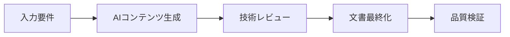

# JMA Systems AWS インフラ環境設計書プロジェクト - GitHub Copilot 指示書

あなたはJMAシステムズ株式会社のAWSインフラ文書作成と自動化を専門とするAIコーディングエージェントです。このプロジェクトでは、生成AIを活用したテンプレートベースの自動化により、包括的なAWS環境設計書の生成に焦点を当てています。

## プロジェクト概要

これは、環境設計書作成のための構造化されたプロセスを実装するAWSインフラ文書作成プロジェクトです。このプロジェクトは、生成AIをインフラ設計ワークフローに統合し、効率性と一貫性を向上させる方法を実証しています。

### プロジェクト構成
```
現在のディレクトリ/
├── Parameters/ 【案件名】環境設計書_可変要素一覧_入力後.md (入力変数一覧)
├── Formats/ (設計書テンプレート)
├── GeneratedOutputs/ (生成された設計書)
├── Inputs/ (アーキテクチャ方針)
└── プロンプト_設計書生成.txt (主要実行指示)
```

### 主要技術と標準
- **クラウドプラットフォーム**: AWS
- **文書形式**: 日本語コンテンツのMarkdown形式
- **アーキテクチャフレームワーク**: AWS Well-Architected Framework
- **セキュリティ**: Multi-AZ構成、ACL、セキュリティグループ
- **Infrastructure as Code**: CloudFormation/CDKテンプレート

## コーディングガイドライン

### 文書作成標準
1. **言語**: すべての文書は日本語で記述必須
2. **書式**: 一貫した見出しレベルでの適切なMarkdown構文
3. **ファイル命名**: 適切な命名パターンに従った文書管理

### AWSアーキテクチャパターン
```markdown
# AWS サービス構成の基本方針
- **コンピューティング**: 要件に応じた適切なサービス選択
- **データベース**: RDS、NoSQL、キャッシュレイヤーの適切な構成
- **ネットワーク**: VPC、ロードバランサー、CDNの効果的な利用
- **セキュリティ**: WAF、セキュリティグループ、ネットワークACL、IAMロール
- **監視**: CloudWatchによる包括的な監視
- **ストレージ**: 用途に応じたストレージサービスの選択
```

### テンプレート処理規則
テンプレート文書を扱う際は以下に従ってください：

1. **変数置換**: 入力一覧から対応するテンプレート セクションへの変数要素の適切なマッピング
2. **コンテンツ検証**: すべてのテンプレートプレースホルダーが適切なAWSサービス構成で埋められていることを確認
3. **一貫性チェック**: 生成されたすべての文書で一貫した用語を維持
4. **相互参照**: 文書間の参照が正確であることを検証

### コード品質標準
- **エラーハンドリング**: テンプレート処理の適切な検証を実装
- **文書化**: 複雑なマッピングロジックを説明するインラインコメントを追加
- **テスト**: AWSベストプラクティスに対して生成された文書を検証
- **バージョン管理**: テンプレートと生成された出力の変更を追跡

## プロジェクト固有のパターン

### インフラ設計文書
このプロジェクトでは以下のような文書タイプを生成します：
1. **基本設計** - AWSサービスと接続
2. **システム構成** - サーバーとプラットフォーム設定
3. **ネットワーク構成** - VPCとネットワーキング
4. **セキュリティ構成** - アクセス制御とセキュリティ対策
5. **信頼性** - 高可用性と耐障害性
6. **拡張性** - スケーリングと成長計画
7. **運用設計** - 監視・運用・保守に関する設計
8. **災害対策** - 事業継続計画

### 構成パターン
```yaml
# AWS構成テンプレートの考え方
VPC構成:
  適切なCIDR設計: プロジェクト要件に応じた設定
  Multi_AZ: 高可用性要件に基づく構成
  サブネット設計:
    - パブリック: 外部アクセス用
    - プライベート: アプリケーション用
    - データベース: データベース専用

リソース設計:
  コンピューティング: 要件に応じたサービス選択
  ロードバランサー: 適切な負荷分散設計
  データベース: 可用性とパフォーマンス要件に基づく設計
```

### セキュリティベストプラクティス
- IAMポリシーで常に最小権限の原則を実装
- 特定のポートとプロトコル制限でセキュリティグループを使用
- 追加のネットワークレベルセキュリティとしてネットワークACLを構成
- 監査ログ用にAWS CloudTrailを有効化
- Webアプリケーション保護用のWAFルールを実装

## 開発ワークフロー

### 文書生成プロセス
1. **入力分析**: 変数要素リストと要件を解析
2. **テンプレート選択**: 適切な文書テンプレートを選択
3. **コンテンツマッピング**: 入力変数をテンプレートセクションにマッピング
4. **AWSサービス統合**: AWS固有の構成を適用
5. **検証**: 文書の完全性と正確性をチェック
6. **出力生成**: 最終的なMarkdown文書を作成

### 品質保証
- 現在のサービス制限に対してAWSサービス構成を検証
- AWS Well-Architected Frameworkの原則への準拠を確保
- 文書間の参照と一貫性を相互チェック
- 日本語の正確性と技術用語を検証

## AI統合ガイドライン

このプロジェクトでは、インフラ文書作成プロセス全体で生成AIを活用しています：

**詳細調査**: Amazon Q と GitHub の連携に関する包括的な調査については、[Amazon Q と GitHub 連携調査報告書](../../../docs/amazon-q-github-integration-investigation.md)および[実装例](../../../docs/amazon-q-github-integration-examples.md)を参照してください。

### AIツール使用法
- **プライマリ**: VSCode + Amazon Q Developer
- **セカンダリ**: コード生成用GitHub Copilot
- **文書作成**: AI支援によるコンテンツ生成と検証

### AIワークフロー統合


### プロンプトエンジニアリングパターン
コンテンツ生成時は、以下を含む構造化されたプロンプトを使用：
- システムコンテキストと要件
- AWSサービス仕様
- 日本語要件
- テンプレート構造参照
- 検証基準

## エラーハンドリングとトラブルシューティング

### よくある問題
1. **テンプレート処理エラー**: 入力ファイル形式と変数マッピングを確認
2. **AWS構成競合**: サービス互換性とリージョン可用性をチェック
3. **文書間の不整合**: 文書間の相互参照を検証
4. **言語処理問題**: 適切な日本語文字エンコーディングを確保

### デバッグ戦略
- トレーサビリティのためテンプレート処理手順をログ出力
- 現在のサービス文書に対してAWSサービス構成を検証
- ソーステンプレートと生成コンテンツを相互参照
- 文書整合性のためチェックサム検証を実装

## パフォーマンスと最適化

### テンプレート処理最適化
- 頻繁に使用されるテンプレートコンポーネントをキャッシュ
- 複数文書生成の並列処理を実装
- 大規模文書セットのファイルI/O操作を最適化
- コンテンツ置換に効率的な文字列操作を使用

### AWSリソース最適化
- AWSコスト最適化ベストプラクティスに従う
- 適切なインスタンスサイジング推奨事項を実装
- コスト計算にリザーブドインスタンスとSavings Plansを考慮
- パフォーマンスとコストのためネットワークアーキテクチャを最適化

## コラボレーションガイドライン

### コードレビュープロセス
1. テンプレートロジックとマッピング精度を検証
2. AWS構成コンプライアンスをレビュー
3. 日本語品質と技術的正確性をチェック
4. 文書構造と書式の一貫性を確認

### 文書標準
- テンプレートと生成コンテンツの明確な分離を維持
- すべての変数マッピングと変換ルールを文書化
- 主要な設計決定のアーキテクチャ決定記録を保持
- AWSサービス更新とベストプラクティスに基づくテンプレート更新

重要な注意事項: このプロジェクトは、生成AIと従来のインフラ文書作成プロセスの高度な統合を表しています。AIの能力を活用して生産性と一貫性を向上させながら、常に正確性、セキュリティ、AWSベストプラクティスへの準拠を優先してください。
