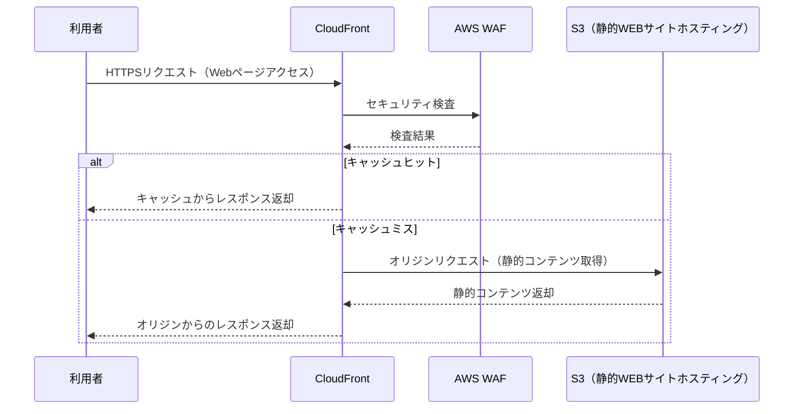
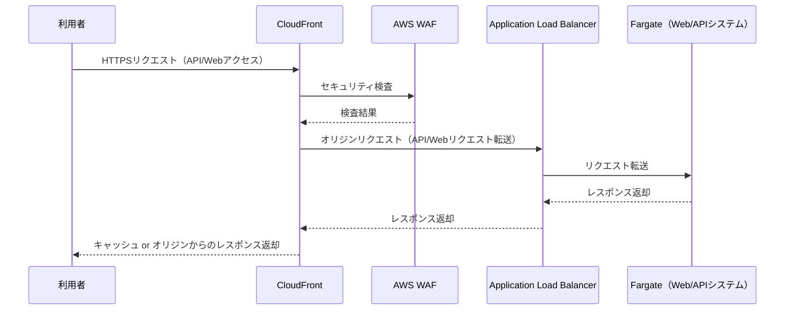
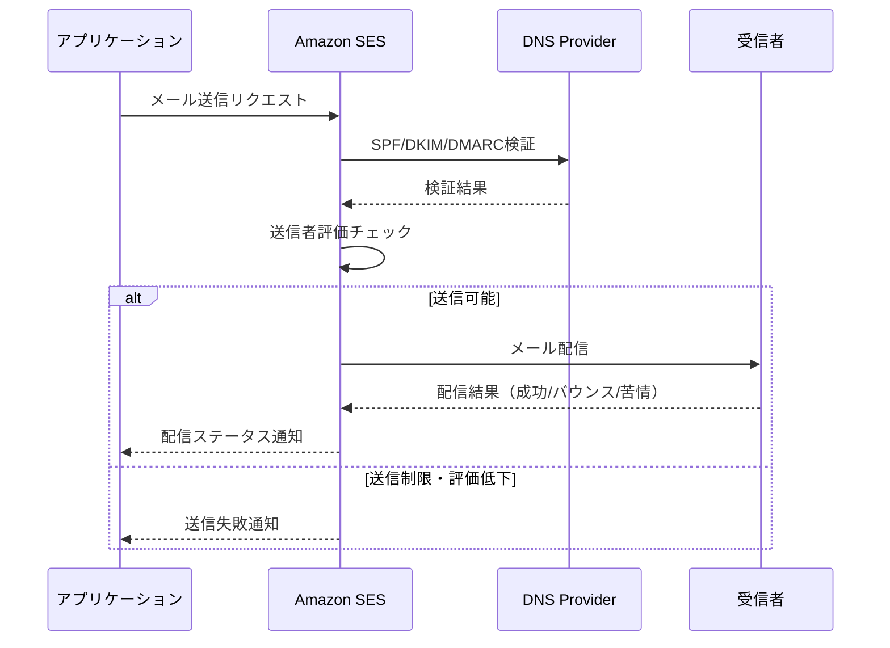

# インフラアーキテクチャ方針書

## オンライン処理方式

### 処理方式概要

| パターン | 採用するアーキテクチャ | 考慮事項 |
|------|------|------|
| フロント処理 | S3（静的WEBサイトホスティング）、CloudFront | S3で静的コンテンツ配信、CloudFrontでグローバル高速化・HTTPS対応。WAF連携で攻撃対策。|
| API処理 | Fargate、CloudFront | Fargateはサーバーレス運用・自動スケール。CloudFrontでAPI高速化。ALB・セキュリティグループ・WAF連携。APIによるDatabase更新。 |
| メール配信 | SES | SPF/DKIM/DMARC設定、バウンス・苦情率監視、送信制限・サンドボックス解除手順。|

### 実現イメージ

#### フロント処理

#### API処理

#### メール配信

