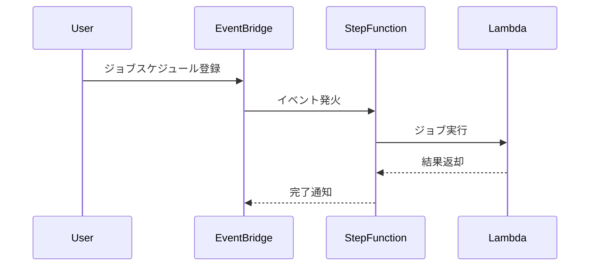
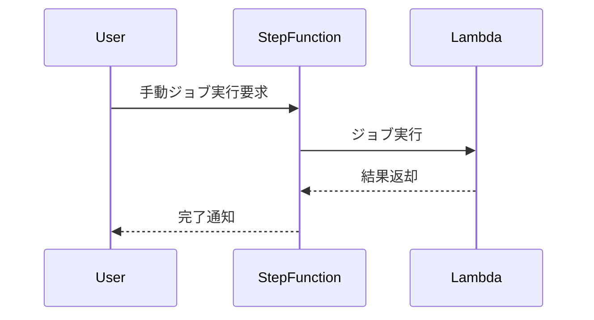

# 結果２_アーキテクチャ方針書_バッチ処理方式

## バッチ処理方式 概要

| パターン | 採用するアーキテクチャ | 考慮事項 |
|------|------|------|
| 定期処理 | EventBridge, StepFunction, Lambda | スケジューリングの遅延・失敗時のリカバリ設計、イベント駆動設計のベストプラクティス（AWS公式参照） |
| 不定期処理 | Step Function | トリガー条件の明確化、手動実行時の認証・監査設計（AWS公式参照） |

## 実現イメージ

### 定期処理（EventBridge + StepFunction + Lambda）

### 不定期処理（Step Function）

---

※「変更後」が「なし」の内容は除外済み。

AWS公式ドキュメント参考：
- https://docs.aws.amazon.com/step-functions/latest/dg/batch-processing.html
- https://docs.aws.amazon.com/eventbridge/latest/userguide/eb-batch.html

