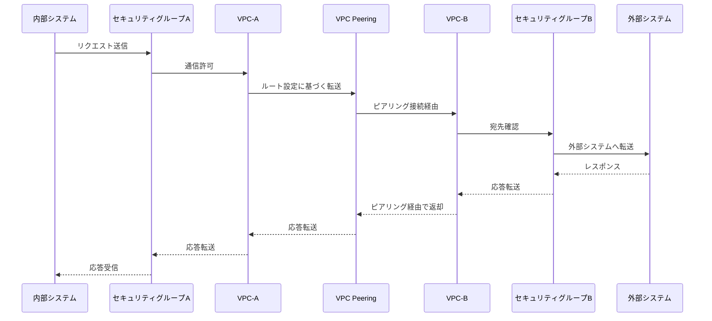
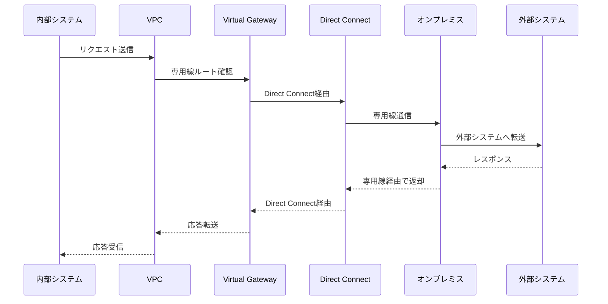
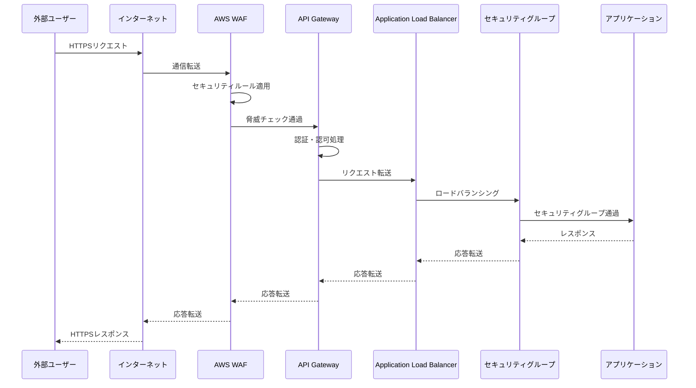
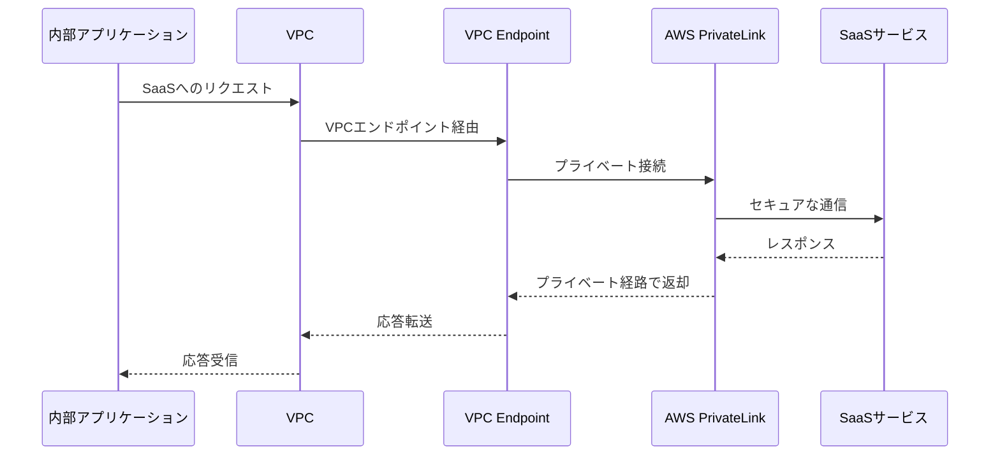
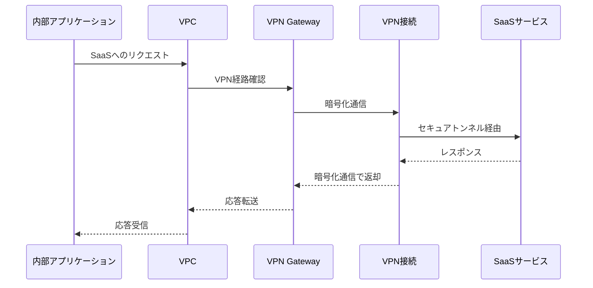
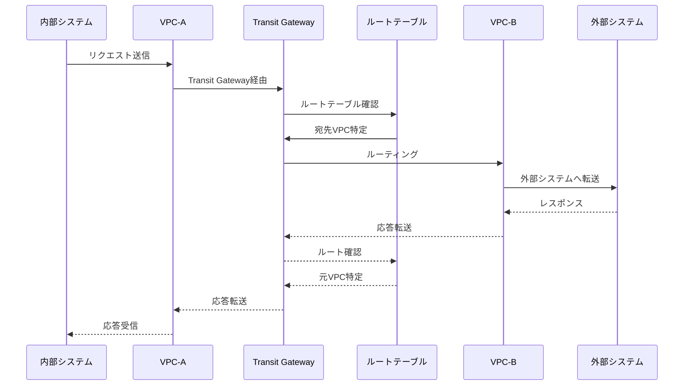
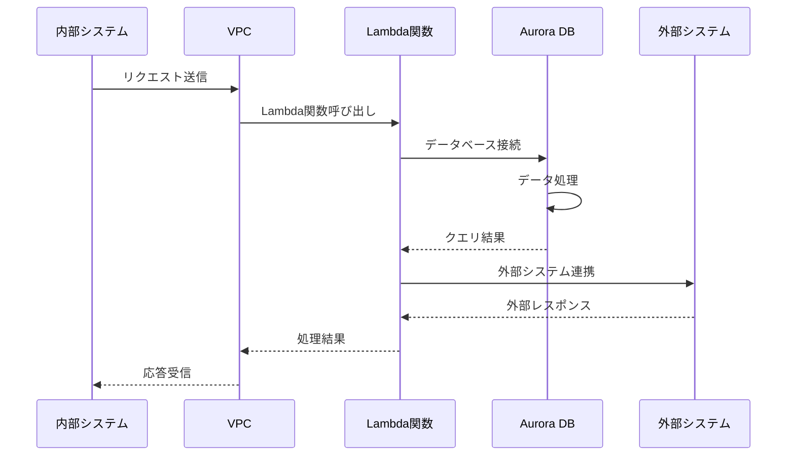
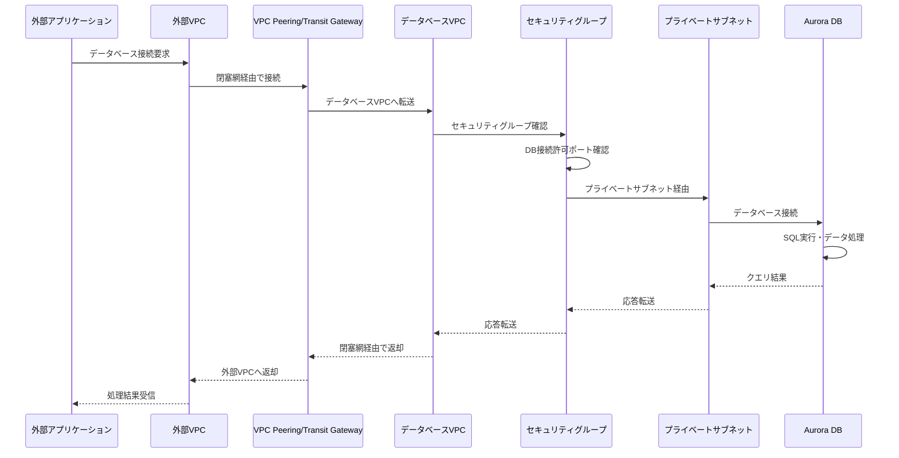
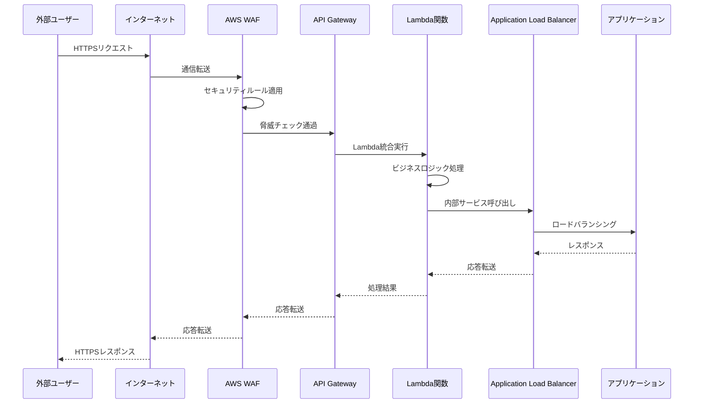
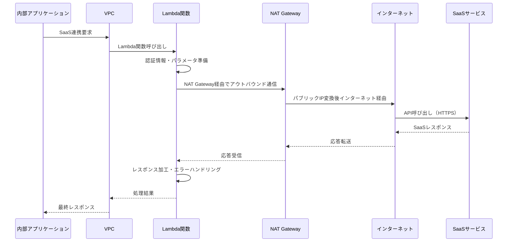

# アーキテクチャ方針書_外部接続方式（結果２）

## 外部接続方式

### 処理方式概要
外部システムとは原則閉塞網で接続する。ただし、SaaS製品への接続はインターネット経由で行うものとする。

| パターン | 採用するアーキテクチャ | 考慮事項 |
| -------- | ---------------------- | -------- |
| 閉塞網接続 | VPC Peering, Direct Connect, Transit Gateway, Lambda, Aurora | セキュリティグループ・ルート設定、帯域・冗長性、コスト管理 |
| インターネット接続 | API Gateway, WAF, ALB, Lambda | 認証・認可、DDoS対策、通信暗号化、WAFルール設計 |
| SaaS接続 | PrivateLink, VPN, NAT Gateway, Lambda | SaaS側仕様確認、通信経路の暗号化、可用性・障害時対応 |

### 実現イメージ

#### 閉塞網接続（VPC Peering）

#### 閉塞網接続（Direct Connect）

#### インターネット接続

#### SaaS接続（PrivateLink）

#### SaaS接続（VPN）

#### 閉塞網接続（Transit Gateway）

#### 閉塞網接続（Lambda + Aurora）

#### 閉塞網接続（外部アプリ ⇔ Aurora）

#### インターネット接続（Lambda統合）

#### SaaS接続（NAT Gateway + Lambda）

---
※考慮事項はAWS公式ドキュメント（VPC Peering, Direct Connect, Transit Gateway, API Gateway, WAF, Lambda, Aurora, PrivateLink, VPN）を参考に簡略化しています。
