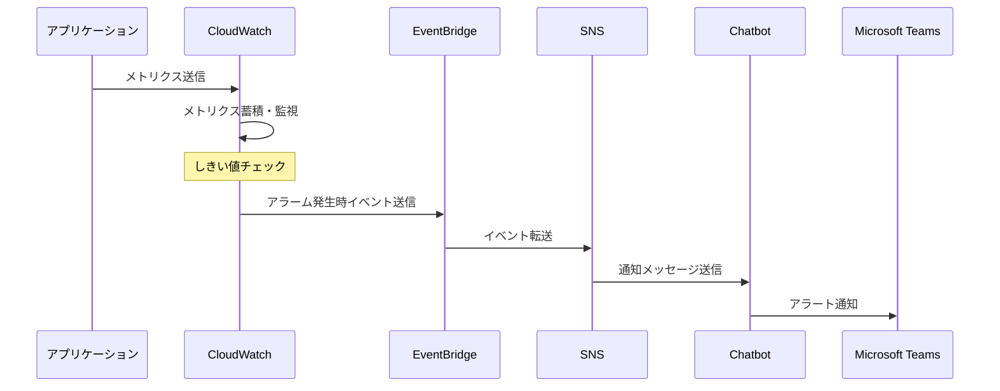
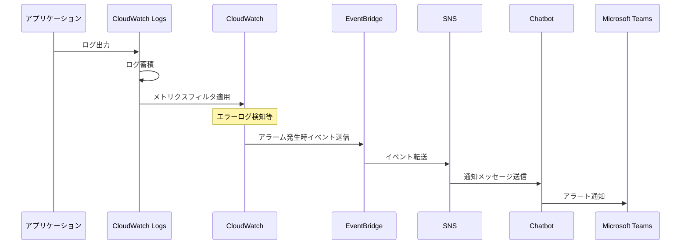
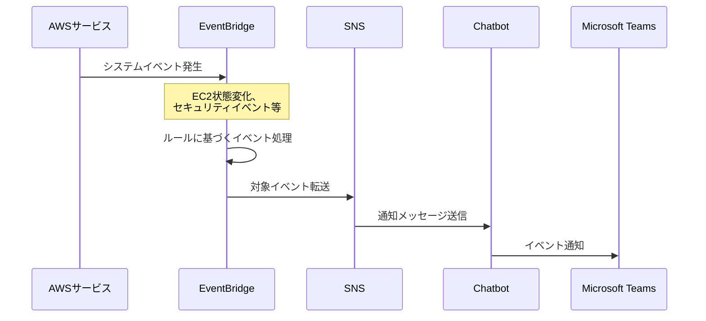

# インフラアーキテクチャ方針書

## 監視方式

### 処理方式概要

| パターン       | 採用するアーキテクチャ                | 考慮事項     |
| -------------- | ------------------------------------- | ------------ |
| メトリクス監視 | CloudWatch、EventBridge、SNS、Chatbot | （手動更新） |
| ログ監視       | CloudWatch、EventBridge、SNS、Chatbot | （手動更新） |
| イベント監視   | EventBridge、SNS、Chatbot             | （手動更新） |

### 実現イメージ

#### メトリクス監視パターンのシーケンス図

#### ログ監視パターンのシーケンス図

#### イベント監視パターンのシーケンス図

