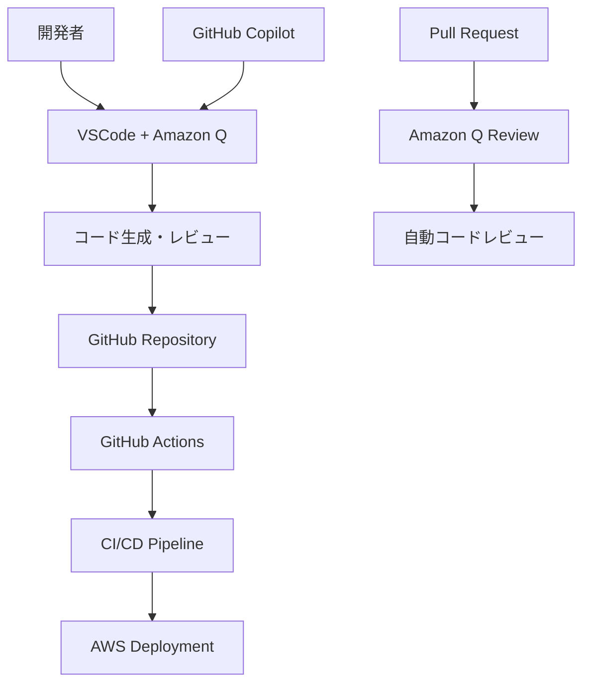

# Amazon Q と GitHub の連携に関する調査報告書

## 概要

本文書は、Amazon Q（特にAmazon Q Developer）とGitHubの連携について包括的に調査し、現在のプロジェクトでの活用状況と今後の改善提案をまとめたものです。

## 1. Amazon Q と GitHub 連携の基本概念

### 1.1 Amazon Q Developer とは

Amazon Q Developerは、AWSが提供するAI駆動の開発者支援ツールです：

- **コード生成**: 自然言語からのコード生成
- **コード説明**: 既存コードの解析と説明
- **デバッグ支援**: エラーの特定と修正提案
- **セキュリティスキャン**: コードの脆弱性検出
- **AWS統合**: AWSサービスに特化した支援

### 1.2 GitHub との連携パターン



## 2. 現在のプロジェクトでの活用状況

### 2.1 既存の統合構成

現在のプロジェクトでは以下の統合が実装されています：

```yaml
AI統合ツール構成:
  プライマリ: "VSCode + Amazon Q Developer"
  セカンダリ: "GitHub Copilot"
  用途:
    - AWS環境設計書の自動生成
    - テンプレートベースの文書作成
    - コード品質向上
    - 技術文書の検証
```

### 2.2 ワークフロー統合


## 3. 連携のメリット

### 3.1 開発効率の向上

- **自動コード生成**: 繰り返し作業の削減
- **インテリジェントな提案**: コンテキストに応じた適切な提案
- **AWS特化支援**: AWSサービスに最適化された支援

### 3.2 品質向上

- **一貫性の確保**: テンプレートベースの標準化
- **エラー削減**: AI支援による品質チェック
- **ベストプラクティス適用**: AWS Well-Architected Frameworkの自動適用

### 3.3 コラボレーション強化

- **統一された開発環境**: チーム全体での一貫した開発体験
- **知識共有**: AIによる技術知識の標準化
- **レビュープロセス改善**: 自動化されたコードレビュー

## 4. 実装パターンとベストプラクティス

### 4.1 プロンプトエンジニアリングパターン

効果的なAmazon Q活用のための構造化プロンプト：

```markdown
# 構造化プロンプトテンプレート

## システムコンテキスト
- プロジェクト: AWS環境設計書生成
- 対象: [具体的なAWSサービス]
- 要件: [具体的な要件]

## AWSサービス仕様
- サービス: [使用するAWSサービス]
- リージョン: [対象リージョン]
- 構成: [アーキテクチャ構成]

## 出力要件
- 言語: 日本語
- 形式: Markdown
- 構造: [テンプレート構造参照]

## 検証基準
- AWS Well-Architected Framework準拠
- セキュリティベストプラクティス適用
- コスト最適化考慮
```

### 4.2 GitHub Actions との統合

```yaml
# .github/workflows/amazon-q-integration.yml
name: Amazon Q Integration Workflow

on:
  pull_request:
    branches: [ main ]
  push:
    branches: [ main ]

jobs:
  amazon-q-review:
    runs-on: ubuntu-latest
    steps:
      - uses: actions/checkout@v4
      
      - name: Amazon Q Code Review
        uses: aws-actions/amazon-q-developer-action@v1
        with:
          review-type: 'security-and-quality'
          aws-region: 'ap-northeast-1'
          
      - name: Generate Documentation
        run: |
          # Amazon Q を使用した文書生成スクリプト
          python scripts/generate-docs-with-amazon-q.py
```

### 4.3 セキュリティ統合パターン

```python
# Amazon Q セキュリティスキャン統合例
import boto3
from amazon_q_developer import SecurityScanner

def scan_infrastructure_code():
    """
    Amazon Q を使用したインフラコードのセキュリティスキャン
    """
    scanner = SecurityScanner()
    
    # CloudFormationテンプレートのスキャン
    results = scanner.scan_cloudformation('templates/')
    
    # セキュリティ問題の検出と報告
    for issue in results.security_issues:
        print(f"セキュリティ問題: {issue.description}")
        print(f"推奨修正: {issue.recommendation}")
        
    return results
```

## 5. セキュリティ考慮事項

### 5.1 データプライバシー

- **コード機密性**: 機密情報を含むコードの取り扱い
- **データ保護**: Amazon Q での処理データの保護
- **アクセス制御**: 適切なIAMロールとポリシーの設定

### 5.2 セキュリティベストプラクティス

```yaml
セキュリティ設定:
  IAM設定:
    - 最小権限の原則
    - ロールベースアクセス制御
    - 定期的な権限レビュー
    
  データ保護:
    - 機密情報のマスキング
    - 暗号化の適用
    - ログの適切な管理
    
  監査:
    - CloudTrailによる操作ログ
    - 定期的なセキュリティレビュー
    - コンプライアンス確認
```

## 6. 課題と制限事項

### 6.1 技術的課題

- **API制限**: Amazon Q APIの利用制限
- **レスポンス時間**: 大規模プロジェクトでの処理時間
- **精度**: AI生成コードの品質保証

### 6.2 運用課題

- **学習コスト**: チームメンバーの習熟
- **依存性**: AIツールへの過度な依存
- **メンテナンス**: 統合システムの保守

## 7. 今後の改善提案

### 7.1 短期的改善（1-3ヶ月）

1. **GitHub Actions統合の強化**
   - Amazon Q による自動コードレビューの実装
   - セキュリティスキャンの自動化

2. **プロンプトテンプレートの標準化**
   - 再利用可能なプロンプトライブラリの構築
   - チーム共通のベストプラクティス定義

### 7.2 中期的改善（3-6ヶ月）

1. **カスタムワークフローの開発**
   - プロジェクト固有のAmazon Q統合
   - 自動文書生成パイプラインの構築

2. **品質メトリクスの導入**
   - AI生成コードの品質測定
   - 継続的改善プロセスの確立

### 7.3 長期的改善（6ヶ月以上）

1. **エンタープライズ統合**
   - 組織全体でのAmazon Q活用標準化
   - 高度なカスタマイゼーション

2. **AI駆動開発プロセスの確立**
   - 完全自動化されたインフラ文書生成
   - インテリジェントな品質保証システム

## 8. まとめ

Amazon Q と GitHub の連携は、AWS環境設計書生成プロジェクトにおいて大きな価値を提供しています。現在の統合を基盤として、段階的な改善を通じて、より効率的で高品質な開発プロセスを実現できます。

継続的な改善と最新技術の活用により、チームの生産性向上とプロジェクトの成功を支援していきます。
