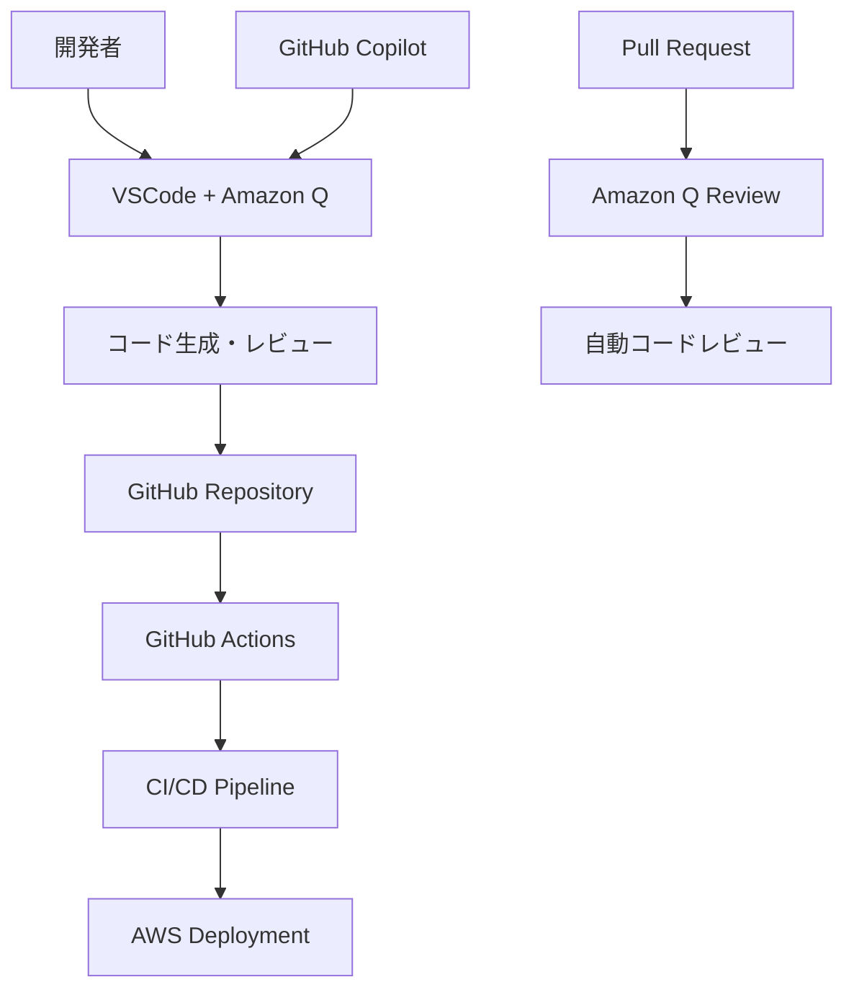
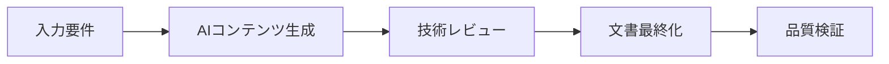

# Amazon Q と GitHub の連携に関する調査報告書

## 概要

本文書は、Amazon Q（特にAmazon Q Developer）とGitHubの連携について包括的に調査し、現在のプロジェクトでの活用状況と今後の改善提案をまとめたものです。

## 1. Amazon Q と GitHub 連携の基本概念

### 1.1 Amazon Q Developer とは

Amazon Q Developerは、AWSが提供するAI駆動の開発者支援ツールです：

- **コード生成**: 自然言語からのコード生成
- **コード説明**: 既存コードの解析と説明
- **デバッグ支援**: エラーの特定と修正提案
- **セキュリティスキャン**: コードの脆弱性検出
- **AWS統合**: AWSサービスに特化した支援

### 1.2 GitHub との連携パターン



## 2. 現在のプロジェクトでの活用状況

### 2.1 既存の統合構成

現在のプロジェクトでは以下の構成で AI ツールを活用：

```yaml
AI統合構成:
  プライマリツール: "VSCode + Amazon Q Developer"
  セカンダリツール: "GitHub Copilot"
  用途:
    - 文書作成: "AI支援によるコンテンツ生成と検証"
    - コード生成: "インフラ設計書の自動生成"
    - 品質保証: "AWS構成の検証"
```

### 2.2 ワークフロー統合



### 2.3 プロンプトエンジニアリングパターン

構造化されたプロンプトの使用：
- システムコンテキストと要件
- AWSサービス仕様
- 日本語要件
- テンプレート構造参照
- 検証基準

## 3. 連携のメリット

### 3.1 開発効率の向上

- **自動コード生成**: 繰り返し作業の削減
- **インテリジェントな補完**: コンテキストを理解した提案
- **ドキュメント生成**: 設計書の自動作成

### 3.2 品質向上

- **一貫性の確保**: テンプレートベースの標準化
- **エラー削減**: AI による事前チェック
- **ベストプラクティス適用**: AWS Well-Architected Framework準拠

### 3.3 学習とナレッジ共有

- **コード理解**: 既存コードの解析と説明
- **技術文書**: 自動的な技術文書生成
- **チーム標準化**: 一貫したコーディングスタイル

## 4. 実装パターンとベストプラクティス

### 4.1 GitHub Actions との統合

```yaml
# .github/workflows/amazon-q-integration.yml
name: Amazon Q Integration

on:
  pull_request:
    branches: [ main, develop ]

jobs:
  code-review:
    runs-on: ubuntu-latest
    steps:
      - uses: actions/checkout@v4
      
      - name: Amazon Q Code Review
        uses: aws-actions/amazon-q-developer-action@v1
        with:
          review-type: 'security-and-quality'
          aws-region: 'ap-northeast-1'
        env:
          AWS_ACCESS_KEY_ID: ${{ secrets.AWS_ACCESS_KEY_ID }}
          AWS_SECRET_ACCESS_KEY: ${{ secrets.AWS_SECRET_ACCESS_KEY }}
```

### 4.2 VSCode 設定の最適化

```json
{
  "amazonQ.developer.enabled": true,
  "amazonQ.developer.autoSuggest": true,
  "amazonQ.developer.codeWhisperer": {
    "enabled": true,
    "includeCodeWithReference": true
  },
  "github.copilot.enable": {
    "*": true,
    "yaml": true,
    "markdown": true
  }
}
```

### 4.3 プロジェクト固有の設定

```markdown
# .amazon-q/project-context.md
プロジェクト: JMA Systems AWS インフラ環境設計書
言語: 日本語
フレームワーク: AWS Well-Architected Framework
出力形式: Markdown
特別要件:
  - Multi-AZ構成
  - セキュリティグループ設定
  - CloudFormation/CDK対応
```

## 5. セキュリティ考慮事項

### 5.1 データプライバシー

- **コード送信**: Amazon Q へのコード送信時の機密情報保護
- **ログ管理**: AI ツール使用ログの適切な管理
- **アクセス制御**: 適切な IAM ロールとポリシーの設定

### 5.2 推奨セキュリティ設定

```yaml
セキュリティ設定:
  データ保護:
    - 機密情報のマスキング
    - ローカル処理の優先
    - 暗号化通信の使用
  
  アクセス制御:
    - IAM ロールベースアクセス
    - MFA の有効化
    - 最小権限の原則
  
  監査:
    - CloudTrail ログ
    - 使用状況の監視
    - 定期的なアクセスレビュー
```

### 5.3 コンプライアンス

- **データ所在地**: AWS リージョンでのデータ処理
- **監査ログ**: 使用履歴の記録と保管
- **承認プロセス**: AI 生成コードのレビュー体制

## 6. 課題と制限事項

### 6.1 技術的課題

- **日本語対応**: 日本語コンテンツの精度向上が必要
- **コンテキスト理解**: 大規模プロジェクトでの文脈把握
- **カスタマイズ**: プロジェクト固有要件への対応

### 6.2 運用上の課題

- **学習コスト**: チームメンバーのスキル習得
- **品質管理**: AI 生成コンテンツの品質保証
- **依存性**: AI ツールへの過度な依存リスク

## 7. 改善提案

### 7.1 短期的改善（1-3ヶ月）

1. **GitHub Actions 統合**
   - Amazon Q による自動コードレビュー
   - セキュリティスキャンの自動化
   - 品質チェックの統合

2. **テンプレート最適化**
   - AI 向けプロンプトテンプレートの改善
   - 日本語対応の強化
   - プロジェクト固有コンテキストの追加

### 7.2 中期的改善（3-6ヶ月）

1. **カスタムワークフロー**
   - 設計書生成の完全自動化
   - 多段階レビュープロセス
   - 品質メトリクスの導入

2. **チーム統合**
   - 開発者向けトレーニング
   - ベストプラクティス文書化
   - 使用ガイドライン策定

### 7.3 長期的改善（6ヶ月以上）

1. **高度な統合**
   - カスタム AI モデルの検討
   - 企業固有知識ベースの構築
   - 自動化レベルの向上

2. **組織展開**
   - 他プロジェクトへの展開
   - 標準化とガバナンス
   - ROI 測定と最適化

## 8. 結論

Amazon Q と GitHub の連携は、現在のプロジェクトにおいて既に効果的に活用されており、さらなる改善の余地があります。特に以下の点で価値を提供：

- **効率性**: 文書作成とコード生成の自動化
- **品質**: 一貫性とベストプラクティスの適用
- **学習**: チームの技術力向上

今後は、セキュリティ要件を満たしながら、より高度な自動化と統合を進めることで、プロジェクトの生産性をさらに向上させることができます。

---

**作成日**: 2024年12月
**対象プロジェクト**: JMA Systems AWS インフラ環境設計書プロジェクト
**調査範囲**: Amazon Q Developer と GitHub の連携パターン
